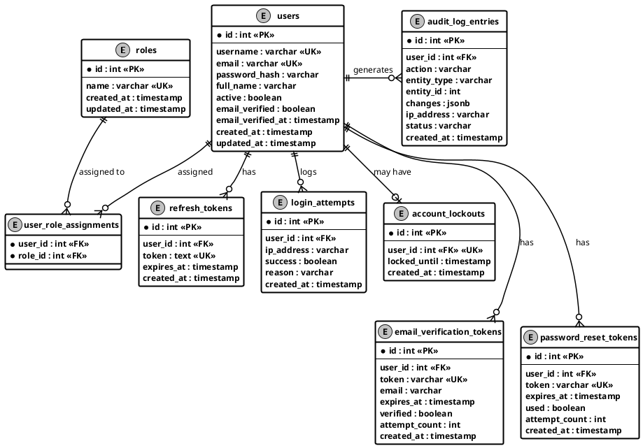
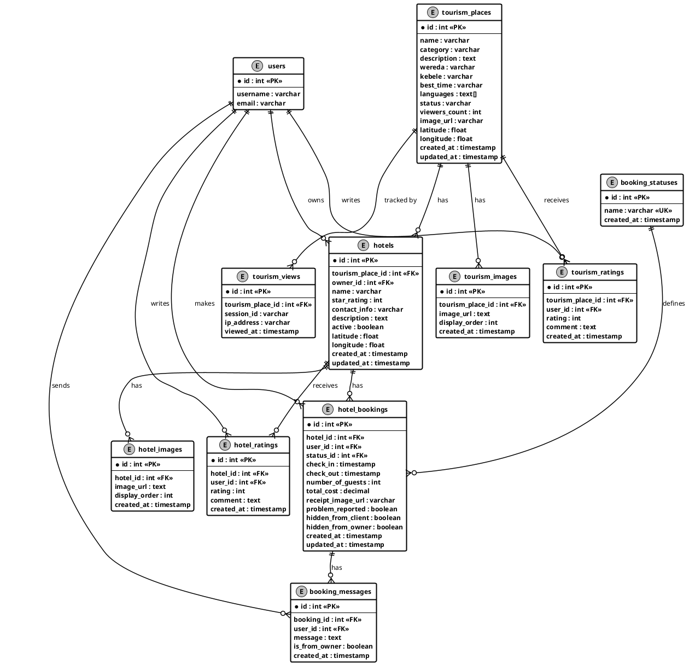
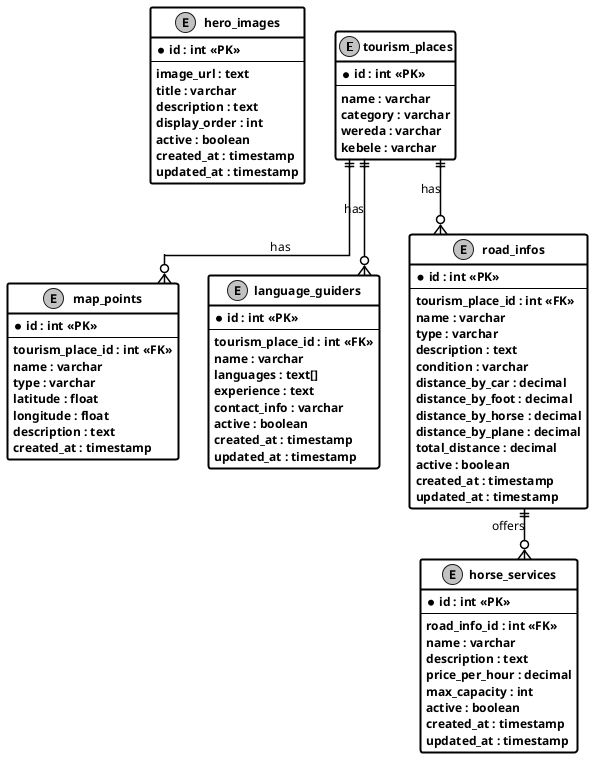

# Entity Relationship Diagram — North Wollo Tourism System

Paste each block into: https://www.plantuml.com/plantuml/uml/

---

## ER Page 1 — User and Authentication Entities

---

## ER Page 2 — Tourism, Hotel and Booking Entities

---

## ER Page 3 — Road, Horse, Language Guider, Map and Hero Entities

---

## Table Summary

| Page | Entities | Theme |
|------|----------|-------|
| **Page 1** | users, roles, user_role_assignments, refresh_tokens, login_attempts, account_lockouts, email_verification_tokens, password_reset_tokens, audit_log_entries | Authentication & Security |
| **Page 2** | tourism_places, tourism_images, tourism_ratings, tourism_views, hotels, hotel_images, hotel_ratings, booking_statuses, hotel_bookings, booking_messages | Tourism & Booking |
| **Page 3** | road_infos, horse_services, language_guiders, map_points, hero_images | Roads, Services & Media |
