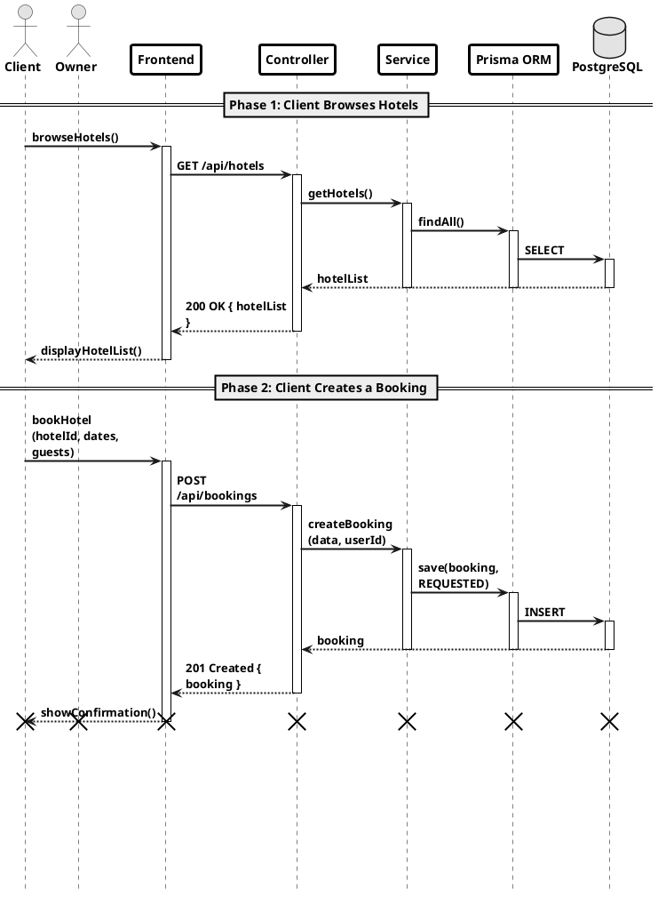
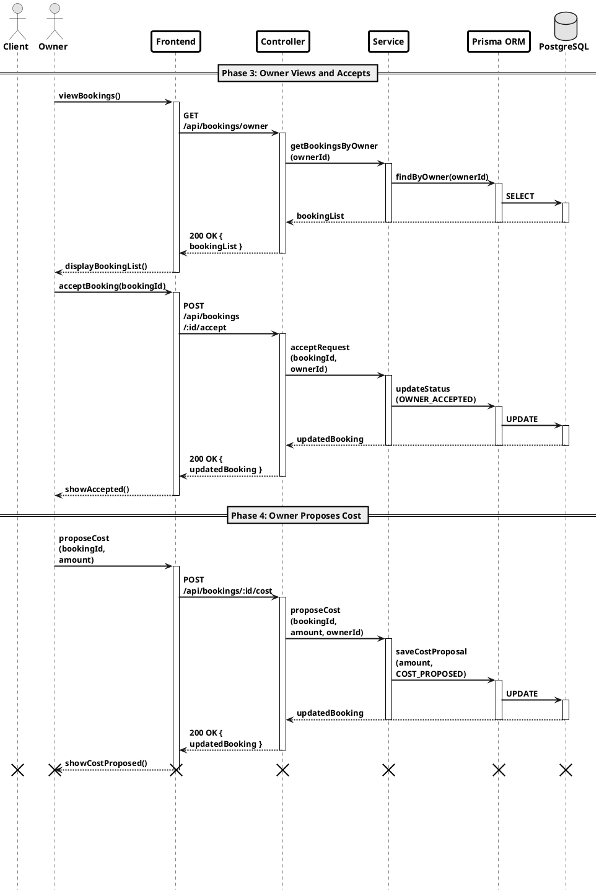
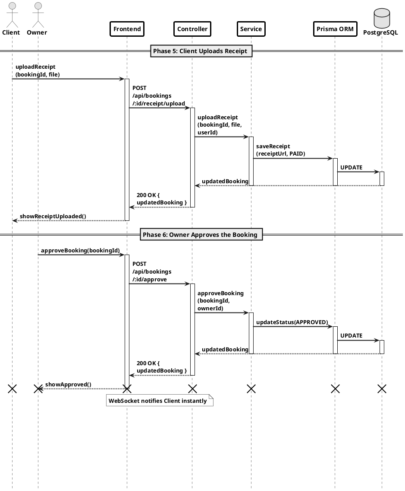

# Hotel Booking Workflow — Sequence Diagrams (3 Pages)

Paste each block into: https://www.plantuml.com/plantuml/uml/

---

## Page 1 — Phase 1 & 2

---

## Page 2 — Phase 3 & 4

---

## Page 3 — Phase 5 & 6

