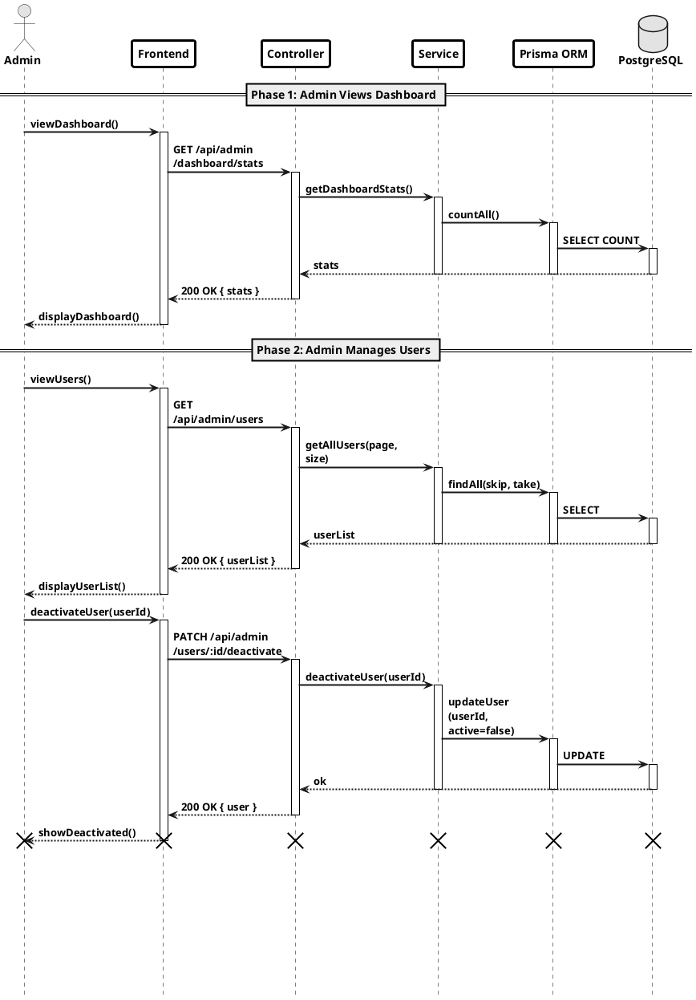
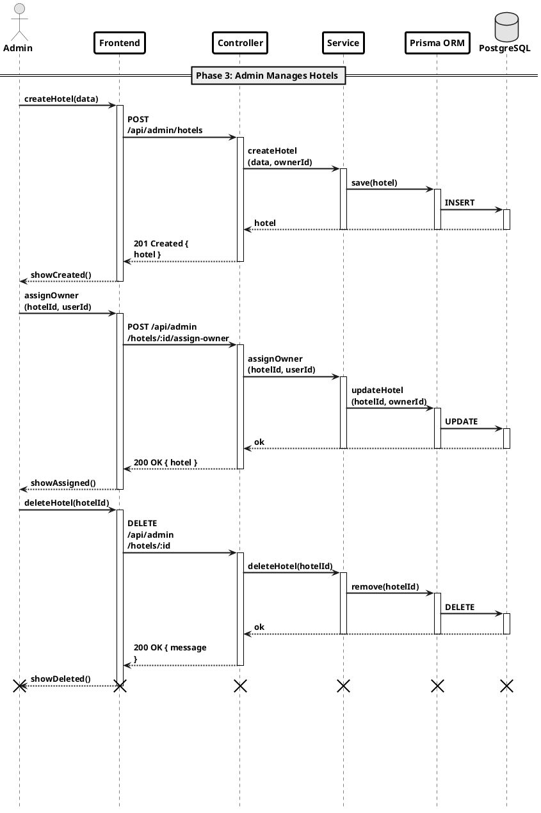

# Admin Management Sequence Diagrams

Paste each block into: https://www.plantuml.com/plantuml/uml/

---

## Admin Page 1 — Dashboard and User Management

```plantuml
@startuml

skinparam defaultFontSize 14
skinparam defaultFontStyle bold
skinparam sequenceArrowThickness 2
skinparam sequenceArrowFontSize 13
skinparam sequenceArrowFontStyle bold
skinparam sequenceParticipantBorderColor black
skinparam sequenceParticipantBorderThickness 3
skinparam sequenceParticipantBackgroundColor white
skinparam sequenceParticipantFontStyle bold
skinparam sequenceParticipantFontSize 14
skinparam sequenceLifeLineBorderColor black
skinparam sequenceLifeLineBorderThickness 2
skinparam sequenceActivationBorderColor black
skinparam sequenceActivationBorderThickness 3
skinparam sequenceActivationBackgroundColor #D0D0D0
skinparam dividerBorderColor black
skinparam dividerFontStyle bold
skinparam dividerFontSize 13
skinparam shadowing false
skinparam monochrome true
skinparam participantPadding 5
skinparam maxMessageSize 120
hide footbox
skinparam sequenceGroupBorderColor black
skinparam sequenceGroupBorderThickness 1
skinparam sequenceGroupBackgroundColor transparent
skinparam sequenceGroupFontStyle bold
skinparam sequenceGroupFontSize 13

actor       "**Admin**"      as A
participant "**Frontend**"   as F
participant "**Controller**" as CT
participant "**Service**"    as S
participant "**Prisma ORM**" as P
database    "**PostgreSQL**" as DB

== Phase 1: Admin Views Dashboard ==

A  ->  F  : viewDashboard()
activate F
F  ->  CT : GET /api/admin\n/dashboard/stats
activate CT
CT ->  S  : getDashboardStats()
activate S
S  ->  P  : countAll()
activate P
P  ->  DB : SELECT COUNT
activate DB
DB --> CT : stats
deactivate DB
deactivate P
deactivate S
CT --> F  : 200 OK { stats }
deactivate CT
F  --> A  : displayDashboard()
deactivate F

== Phase 2: Admin Manages Users ==

A  ->  F  : viewUsers()
activate F
F  ->  CT : GET /api/admin/users
activate CT
CT ->  S  : getAllUsers(page, size)
activate S
S  ->  P  : findAll(skip, take)
activate P
P  ->  DB : SELECT
activate DB
DB --> CT : userList
deactivate DB
deactivate P
deactivate S
CT --> F  : 200 OK { userList }
deactivate CT
F  --> A  : displayUserList()
deactivate F

A  ->  F  : deactivateUser(userId)
activate F
F  ->  CT : PATCH /api/admin\n/users/:id/deactivate
activate CT
CT ->  S  : deactivateUser(userId)
activate S
S  ->  P  : updateUser\n(userId, active=false)
activate P
P  ->  DB : UPDATE
activate DB
DB --> CT : ok
deactivate DB
deactivate P
deactivate S
CT --> F  : 200 OK { user }
deactivate CT
F  --> A  : showDeactivated()
deactivate F

|||
|||
|||
|||
|||
|||
|||
destroy A
destroy F
destroy CT
destroy S
destroy P
destroy DB

@enduml
```

---

## Admin Page 2 — Hotel Management

```plantuml
@startuml

skinparam defaultFontSize 14
skinparam defaultFontStyle bold
skinparam sequenceArrowThickness 2
skinparam sequenceArrowFontSize 13
skinparam sequenceArrowFontStyle bold
skinparam sequenceParticipantBorderColor black
skinparam sequenceParticipantBorderThickness 3
skinparam sequenceParticipantBackgroundColor white
skinparam sequenceParticipantFontStyle bold
skinparam sequenceParticipantFontSize 14
skinparam sequenceLifeLineBorderColor black
skinparam sequenceLifeLineBorderThickness 2
skinparam sequenceActivationBorderColor black
skinparam sequenceActivationBorderThickness 3
skinparam sequenceActivationBackgroundColor #D0D0D0
skinparam dividerBorderColor black
skinparam dividerFontStyle bold
skinparam dividerFontSize 13
skinparam shadowing false
skinparam monochrome true
skinparam participantPadding 5
skinparam maxMessageSize 120
hide footbox
skinparam sequenceGroupBorderColor black
skinparam sequenceGroupBorderThickness 1
skinparam sequenceGroupBackgroundColor transparent
skinparam sequenceGroupFontStyle bold
skinparam sequenceGroupFontSize 13

actor       "**Admin**"      as A
participant "**Frontend**"   as F
participant "**Controller**" as CT
participant "**Service**"    as S
participant "**Prisma ORM**" as P
database    "**PostgreSQL**" as DB

== Phase 3: Admin Manages Hotels ==

A  ->  F  : createHotel(data)
activate F
F  ->  CT : POST /api/admin/hotels
activate CT
CT ->  S  : createHotel\n(data, ownerId)
activate S
S  ->  P  : save(hotel)
activate P
P  ->  DB : INSERT
activate DB
DB --> CT : hotel
deactivate DB
deactivate P
deactivate S
CT --> F  : 201 Created { hotel }
deactivate CT
F  --> A  : showCreated()
deactivate F

A  ->  F  : assignOwner\n(hotelId, userId)
activate F
F  ->  CT : POST /api/admin\n/hotels/:id/assign-owner
activate CT
CT ->  S  : assignOwner\n(hotelId, userId)
activate S
S  ->  P  : updateHotel\n(hotelId, ownerId)
activate P
P  ->  DB : UPDATE
activate DB
DB --> CT : ok
deactivate DB
deactivate P
deactivate S
CT --> F  : 200 OK { hotel }
deactivate CT
F  --> A  : showAssigned()
deactivate F

A  ->  F  : deleteHotel(hotelId)
activate F
F  ->  CT : DELETE /api/admin\n/hotels/:id
activate CT
CT ->  S  : deleteHotel(hotelId)
activate S
S  ->  P  : remove(hotelId)
activate P
P  ->  DB : DELETE
activate DB
DB --> CT : ok
deactivate DB
deactivate P
deactivate S
CT --> F  : 200 OK { message }
deactivate CT
F  --> A  : showDeleted()
deactivate F

|||
|||
|||
|||
|||
|||
|||
destroy A
destroy F
destroy CT
destroy S
destroy P
destroy DB

@enduml
```
