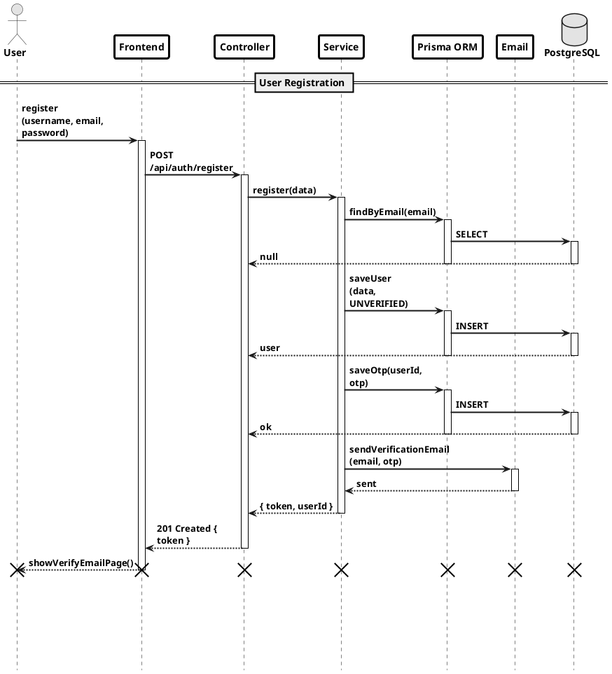
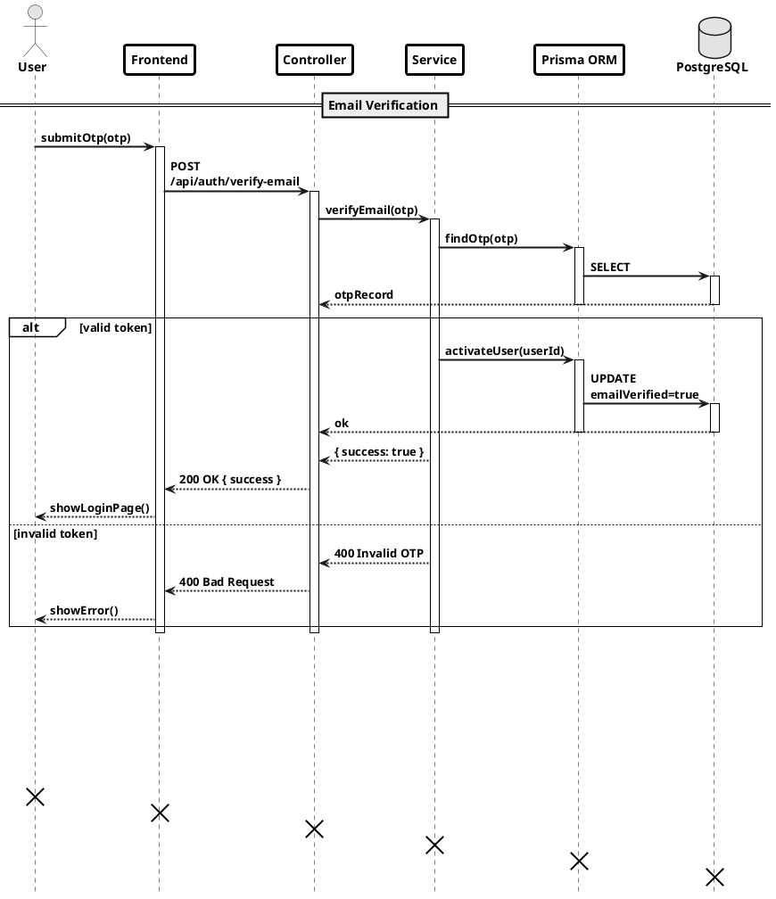
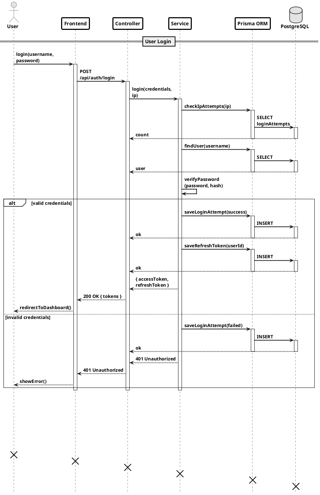

# Authentication Sequence Diagrams

Paste each block into: https://www.plantuml.com/plantuml/uml/

---

## Auth Page 1 — User Registration

---

## Auth Page 2 — Email Verification

---

## Auth Page 3 — User Login

