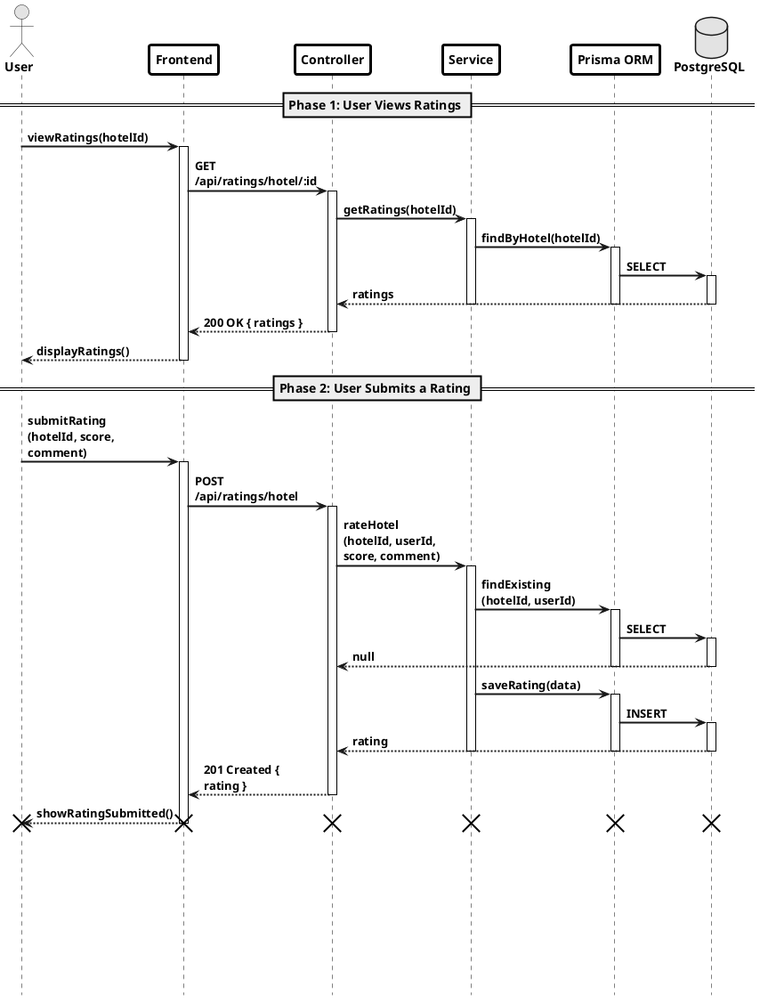

# Rating and Review Sequence Diagram

Paste into: https://www.plantuml.com/plantuml/uml/

---

## Rating Page 1 — View and Submit Rating

```plantuml
@startuml

skinparam defaultFontSize 14
skinparam defaultFontStyle bold
skinparam sequenceArrowThickness 2
skinparam sequenceArrowFontSize 13
skinparam sequenceArrowFontStyle bold
skinparam sequenceParticipantBorderColor black
skinparam sequenceParticipantBorderThickness 3
skinparam sequenceParticipantBackgroundColor white
skinparam sequenceParticipantFontStyle bold
skinparam sequenceParticipantFontSize 14
skinparam sequenceLifeLineBorderColor black
skinparam sequenceLifeLineBorderThickness 2
skinparam sequenceActivationBorderColor black
skinparam sequenceActivationBorderThickness 3
skinparam sequenceActivationBackgroundColor #D0D0D0
skinparam dividerBorderColor black
skinparam dividerFontStyle bold
skinparam dividerFontSize 13
skinparam shadowing false
skinparam monochrome true
skinparam participantPadding 5
skinparam maxMessageSize 120
hide footbox
skinparam sequenceGroupBorderColor black
skinparam sequenceGroupBorderThickness 1
skinparam sequenceGroupBackgroundColor transparent
skinparam sequenceGroupFontStyle bold
skinparam sequenceGroupFontSize 13

actor       "**User**"       as U
participant "**Frontend**"   as F
participant "**Controller**" as CT
participant "**Service**"    as S
participant "**Prisma ORM**" as P
database    "**PostgreSQL**" as DB

== Phase 1: User Views Ratings ==

U  ->  F  : viewRatings(hotelId)
activate F
F  ->  CT : GET /api/ratings/hotel/:id
activate CT
CT ->  S  : getRatings(hotelId)
activate S
S  ->  P  : findByHotel(hotelId)
activate P
P  ->  DB : SELECT
activate DB
DB --> CT : ratings
deactivate DB
deactivate P
deactivate S
CT --> F  : 200 OK { ratings }
deactivate CT
F  --> U  : displayRatings()
deactivate F

== Phase 2: User Submits a Rating ==

U  ->  F  : submitRating\n(hotelId, score, comment)
activate F
F  ->  CT : POST /api/ratings/hotel
activate CT
CT ->  S  : rateHotel\n(hotelId, userId, score, comment)
activate S
S  ->  P  : findExisting\n(hotelId, userId)
activate P
P  ->  DB : SELECT
activate DB
DB --> CT : null
deactivate DB
deactivate P
S  ->  P  : saveRating(data)
activate P
P  ->  DB : INSERT
activate DB
DB --> CT : rating
deactivate DB
deactivate P
deactivate S
CT --> F  : 201 Created { rating }
deactivate CT
F  --> U  : showRatingSubmitted()
deactivate F

|||
|||
|||
|||
|||
|||
|||
destroy U
destroy F
destroy CT
destroy S
destroy P
destroy DB

@enduml
```
